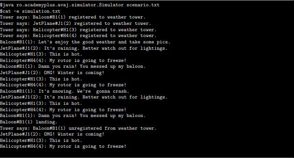

# AvajLauncher

This is an introduction to Java. The goal is to implent a given UML class diagram of a minimal aircraft simulation program.

### Requirements

* Java (Core Programming Language - JDK 8 >)

### Executing

* java src/com/avajtest/simulator/Main.java resources/scenario.txt

### Example

